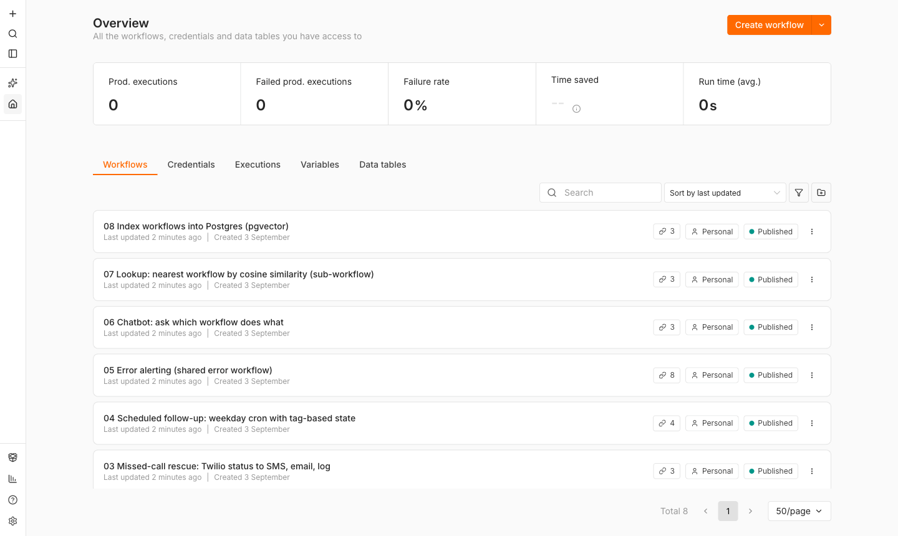
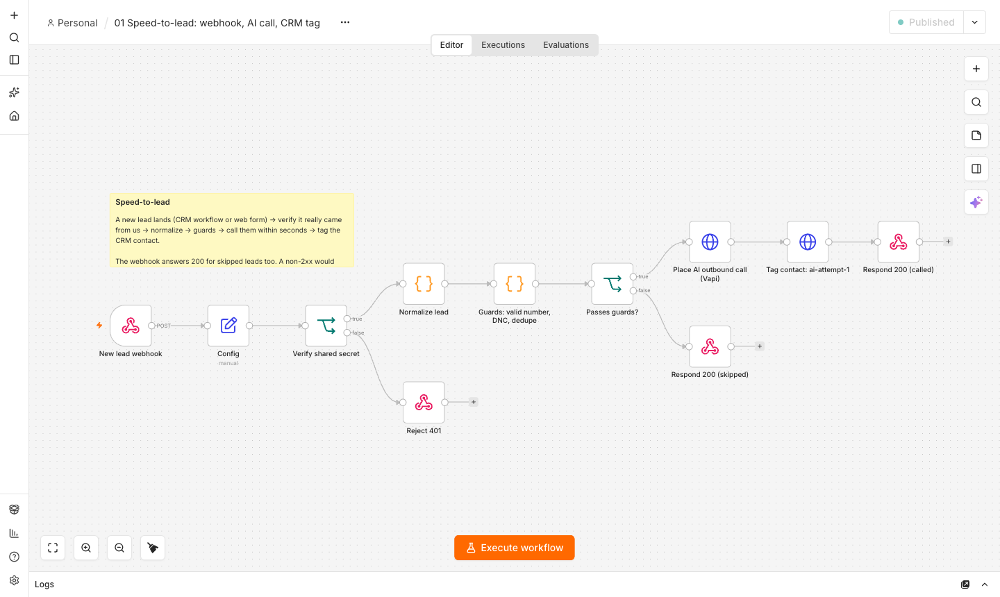
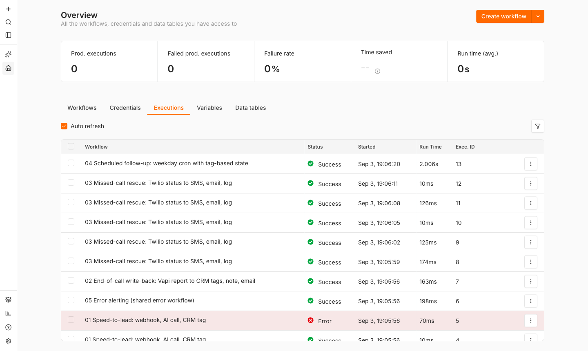
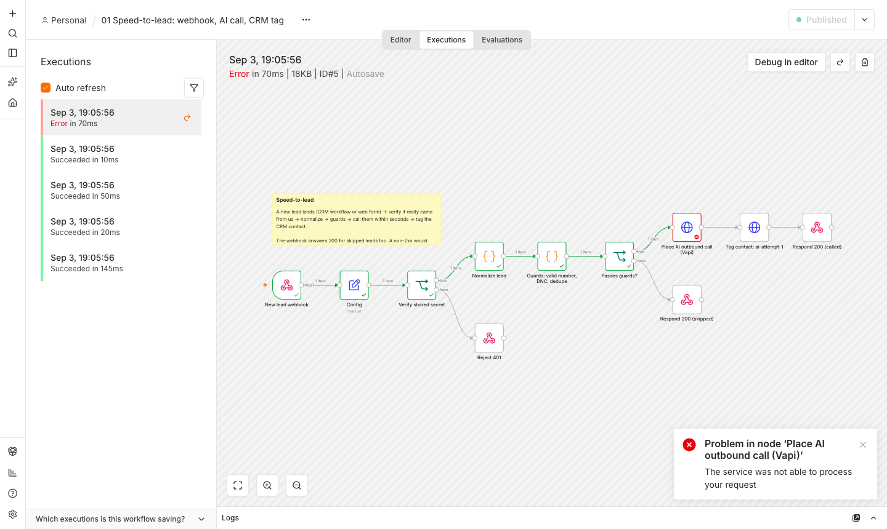
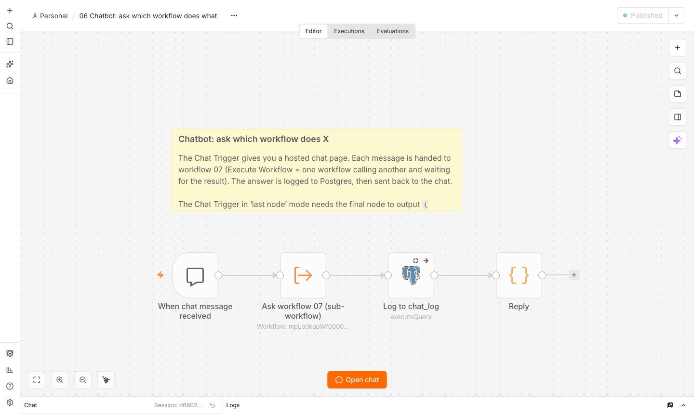
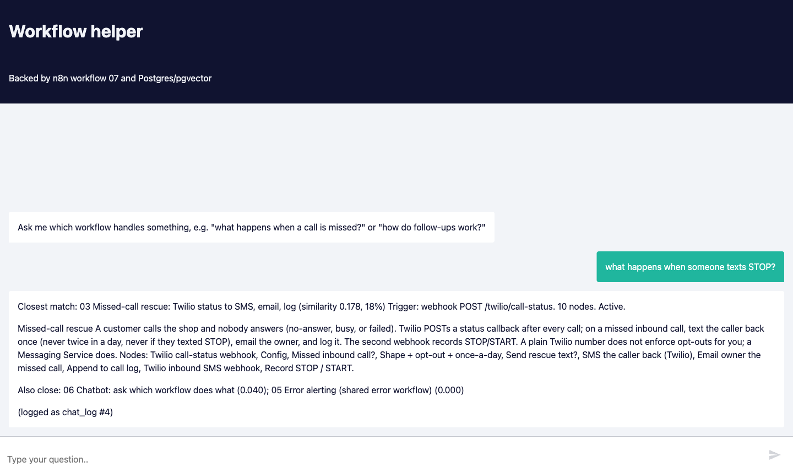

# n8n workflows

Eight n8n workflows that run end to end on a laptop with one command and no
outside accounts. Five are automations I run in production for small-business
clients (AI phone receptionists, speed-to-lead calling, missed-call rescue, CRM
write-backs), rebuilt as n8n. Three are a chatbot on top of them: ask which
workflow does what, get the answer from Postgres with pgvector, log the
conversation.

```bash
brew install postgresql@17 pgvector     # once
npm install                              # once, pulls n8n
bash demo/demo.sh                        # ~1 minute, prints everything it does
bash demo/serve.sh                       # then open http://localhost:5678
```

[docs/run-it-yourself.md](docs/run-it-yourself.md) has the step-by-step.
[docs/demo-transcript.txt](docs/demo-transcript.txt) is what the demo printed
on my machine.

## The workflows

| # | Workflow | Trigger | What it does |
|---|----------|---------|--------------|
| 01 | [Speed-to-lead](workflows/01-speed-to-lead.json) | Webhook `POST /lead` (CRM or web form) | Verifies a shared secret, normalizes two payload shapes, runs guards (valid number, do-not-call, 6-hour dedupe), places an outbound AI call via Vapi within seconds, tags the CRM contact, responds 200 either way. |
| 02 | [End-of-call write-back](workflows/02-end-of-call-writeback.json) | Webhook (Vapi end-of-call report) | Turns the call's structured data into outcome tags (`ai-booked`, `ai-no-answer`, `needs-quote`) and a note on the GoHighLevel contact. The owner email is the backstop and fires even if the CRM call fails. |
| 03 | [Missed-call rescue](workflows/03-missed-call-rescue.json) | Webhook (Twilio call status, Twilio inbound SMS) | On an unanswered inbound call: text the caller back once a day at most, never if they texted STOP, email the owner, append to a log. |
| 04 | [Scheduled follow-up](workflows/04-scheduled-followup.json) | Cron `0 10 * * 1-5`, plus manual | Pulls contacts tagged `ai-no-answer`, decides per contact whether to call again (attempt cap, 6-day window, closed tags), paces the calls, tags `ai-attempt-N`, emails a summary. State lives in CRM tags. |
| 05 | [Error alerting](workflows/05-error-alerting.json) | Error Trigger | Shared error workflow for all the others. Throttles the same (workflow, node) failure to one alert an hour, emails on-call, posts to Slack if configured. |
| 06 | [Chatbot](workflows/06-chatbot-workflow-helper.json) | Chat Trigger (hosted chat page) | Hands each question to workflow 07, logs question, answer and similarity to Postgres `chat_log`, replies in the chat window. |
| 07 | [Lookup sub-workflow](workflows/07-lookup-workflow-subworkflow.json) | Called by 06 (Execute Workflow) | Embeds the question, `ORDER BY embedding <=> $1 LIMIT 3` in pgvector, returns the closest workflow with its cosine similarity. |
| 08 | [Indexer](workflows/08-index-workflows-to-postgres.json) | Cron nightly, plus manual | Reads every workflow from n8n's own REST API, builds a description (name, trigger, nodes, sticky notes), embeds it, upserts into `workflow_index`. |





## What the demo proves

`demo/demo.sh` starts a throwaway Postgres, imports credentials and workflows
into a throwaway n8n, starts mock Vapi / GoHighLevel / Twilio servers and an
SMTP sink, then sends the same HTTP requests the real services send. Every
outcome is checked at the other end: which mock endpoints were hit with which
credentials, which emails arrived, which rows landed in Postgres.

| Event fired | What happened |
|---|---|
| New lead from the CRM | Vapi call placed, contact tagged `ai-attempt-1`, webhook answered `{"ok":true,"called":"+15555550101"}` |
| Same lead again inside 6 h | `{"skipped":"duplicate_within_6h"}`, no second call |
| Web-form shape, bad number | `{"skipped":"invalid_number"}`, still HTTP 200 so the sender does not retry |
| Wrong shared secret | HTTP 401, nothing runs |
| Vapi returns 500 | 3 attempts, execution fails, workflow 05 emails on-call within a second |
| Vapi end-of-call report, booked | `ai-booked` tag + note on the contact, "HOT" email to owner |
| Twilio no-answer callback | Rescue SMS, owner email, log row |
| Same caller again that day | Owner email says "no (already_texted_today)", no second SMS |
| Caller texts STOP, then misses a call | No SMS, reason `opted_out` |
| Follow-up cron run by hand | Calls Sam (attempt 3), skips Dana (booked in the step above), Luis (booked), Priya (attempt cap) |
| Indexer run by hand | 8 rows in `workflow_index`, each with a 256-dim vector |
| "what happens when a customer calls and nobody answers?" | Answer names workflow 03 with its similarity score, row written to `chat_log` |



Execution #5 is the deliberate failure. Open it in the editor and the failing
node is outlined in red with the 500 from the mock:



The chatbot, and the chat page it serves:





## How it is built

- **Config node, not `$env`.** Every workflow starts with a Set node holding
  URLs, secrets and emails. n8n Cloud blocks `$env` and Variables are paid;
  a Config node works everywhere. The demo rewrites those values to point at
  the mocks (`demo/prepare-demo.js`); the JSON in `workflows/` keeps the
  production values.
- **Credentials by name and id, never inline.** Six credentials, imported
  with `n8n import:credentials`, encrypted at rest with the instance key.
- **Guards before side effects.** Number validation, do-not-call, dedupe, and
  once-a-day checks run before the first outbound call or text.
- **State in the system of record.** Follow-up state is CRM tags, so the job
  and the CRM cannot disagree. Short-lived guards use workflow static data.
- **A backstop that always fires.** Owner email goes out even if the CRM API
  is down.
- **One error workflow for all of them**, wired through `settings.errorWorkflow`.
- **Parameterized SQL.** `$1, $2` placeholders in every Postgres node; the
  parameter list is an array expression so values with commas survive.
- **Sub-workflows for reuse.** 06 calls 07 with Execute Workflow; 07 can be
  called by anything else that needs "which workflow is this about?".

## Reading list

- [docs/how-this-works.md](docs/how-this-works.md): webhooks, schedules,
  credentials, and when to use Zapier vs n8n vs code, with the client examples
  each decision came from.
- [docs/interview-prep.md](docs/interview-prep.md): Docker vs npm vs Cloud,
  multi-user and queue mode, sticky sessions, cosine similarity and pgvector.
- [docker-compose.yml](docker-compose.yml): the self-hosted production shape,
  with an optional queue-mode profile.

## Regenerating the JSON

The workflow files are generated by `demo/build-workflows.py` so the shared
pieces (Config node, embedding function, credential ids) stay identical across
all eight. Edit that file and run `npm run build`.
